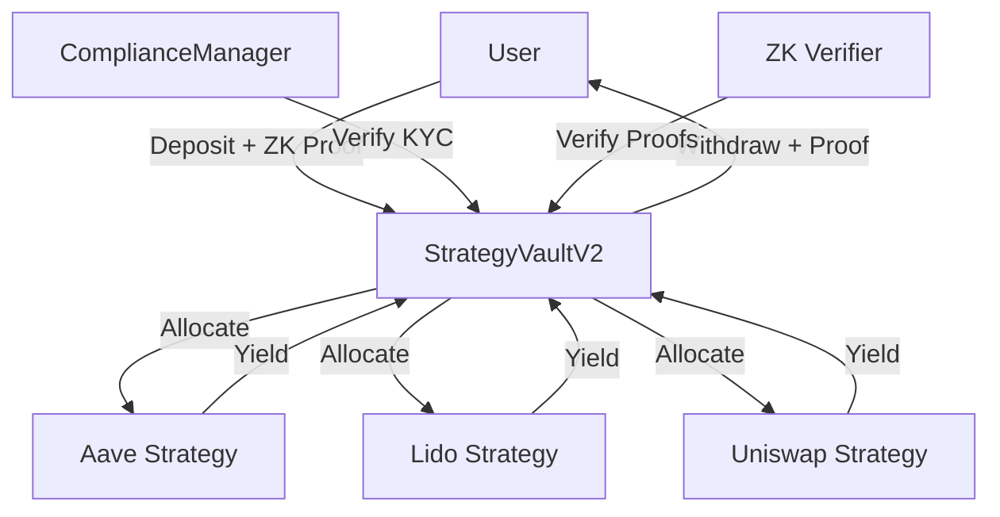

# Protocol Overview

ZK-Yield is a next-generation DeFi protocol that combines **yield aggregation** with **zero-knowledge privacy**. This page provides a comprehensive overview of how the protocol works.

## The Big Picture



## Core Components

### 1. StrategyVaultV2_Multi

The **vault** is the central smart contract that:

- Accepts user deposits
- Distributes funds across strategies
- Tracks user shares
- Processes withdrawals
- Verifies zero-knowledge proofs

**Key Functions**:

```solidity
function deposit() external payable
function depositWithProof(proof, signals) external payable
function withdraw(uint256 shares) external
function allocateToStrategies() external onlyOwner
function harvestYields() external onlyOwner
```

### 2. ComplianceManagerV2

Manages **KYC compliance** without storing personal data:

- Stores ZK proof hashes
- Verifies user compliance status
- Enables privacy-preserving verification

**Privacy Guarantee**: No personal information is stored on-chain.

### 3. DeFi Strategies

Each strategy wraps a DeFi protocol:

| Strategy    | Protocol     | Purpose     | APY Range |
| ----------- | ------------ | ----------- | --------- |
| **Aave**    | Aave V3      | Lending     | 3-8%      |
| **Lido**    | Lido Finance | ETH Staking | 4-5%      |
| **Uniswap** | Uniswap V3   | Liquidity   | 10-30%    |

### 4. ZK Circuits

Two main circuits power privacy:

**KYC Verification Circuit**:

```circom
template KycVerification() {
    signal input userId;
    signal input kycHash;
    signal input timestamp;
    signal output isValid;

    // Verify without revealing identity
}
```

**Balance Proof Circuit**:

```circom
template BalanceProof() {
    signal input balance;
    signal input minRequired;
    signal output sufficient;

    // Prove balance >= minRequired without showing balance
}
```

## How It Works

### User Deposit Flow

1. **User connects wallet** → RainbowKit integration
2. **Complete KYC once** → Generate ZK proof of identity
3. **Deposit funds** → With optional balance proof for privacy
4. **Vault issues shares** → Proportional to deposit amount
5. **Funds allocated** → Admin distributes to strategies
6. **Earn yields** → From multiple DeFi protocols

### Admin Management Flow

1. **Monitor strategy performance** → Track APY, TVL, risks
2. **Rebalance allocation** → Move funds to best-performing strategies
3. **Harvest yields** → Collect earned interest/rewards
4. **Compound or distribute** → Reinvest or pay to users

### Withdrawal Flow

1. **User requests withdrawal** → Specifies share amount
2. **Vault calculates value** → Share price × amount
3. **Liquidate from strategies** → If needed
4. **Transfer to user** → With privacy maintained

## Privacy Features

### What's Private?

✅ **Deposit amounts** - Hidden with ZK proofs  
✅ **Withdrawal amounts** - Protected by cryptography  
✅ **User balances** - Never revealed publicly  
✅ **KYC identity** - Proven without exposure  
✅ **Transaction history** - Encrypted metadata

### What's Public?

❌ **Total vault TVL** - Transparent on-chain  
❌ **Strategy allocations** - Visible percentages  
❌ **Smart contract code** - Open source  
❌ **Proof verification** - Anyone can verify

## Security Model

### Trust Assumptions

1. **Smart Contract Security** - Audited Solidity code
2. **ZK Circuit Correctness** - Circom circuits reviewed
3. **Strategy Safety** - Only vetted DeFi protocols
4. **Admin Honesty** - Multi-sig for critical operations

### Attack Vectors & Mitigations

| Attack                 | Mitigation               |
| ---------------------- | ------------------------ |
| Smart contract exploit | Audits + test coverage   |
| ZK proof forgery       | Cryptographic soundness  |
| Strategy protocol hack | Diversification + limits |
| Malicious admin        | Multi-sig + timelock     |

## Economic Model

### Fee Structure

- **Deposit Fee**: 0% (no entry barrier)
- **Management Fee**: 1% annually (fair for active management)
- **Performance Fee**: 10% of profits (aligned incentives)
- **Withdrawal Fee**: 0.1% (prevent attacks)

### Yield Distribution

```
Gross Yield (e.g., 10%)
  ├─ 89% → User (direct benefit)
  ├─ 10% → Performance fee (protocol)
  └─ 1% → Management fee (operations)
```

## Deployment Information

### Mantle Sepolia Testnet

- **Network**: Mantle Sepolia
- **Chain ID**: 5003
- **RPC**: https://rpc.sepolia.mantle.xyz
- **Explorer**: https://explorer.sepolia.mantle.xyz

### Contract Addresses

See [Contract Addresses](../smart-contracts/deployment/contract-addresses) for deployed contracts.

## Next Steps

Learn more about specific aspects:

- [Core Concepts](../core-concepts/key-concepts-definitions/yield-aggregation) - Understand key terms
- [Protocol Design](../protocol-design/architecture-overview/core-vault-layer) - Deep dive into architecture
- [ZK Circuits](../zk-circuits/introduction) - Explore privacy implementation
- [User Guide](../core-flow/user-flow/wallet-connection) - Start using the protocol
