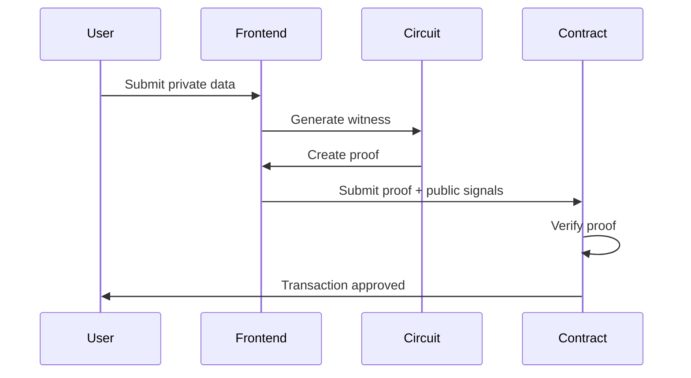

# Zero-Knowledge Circuits

Zero-Knowledge circuits are the **heart of ZK-Yield's privacy features**. This section explains how we use **Circom** and **ZK-SNARKs** to enable privacy-preserving DeFi.

## What are Zero-Knowledge Proofs?

A **zero-knowledge proof** (ZKP) allows one party to prove to another that a statement is true **without revealing any information** beyond the validity of the statement itself.

### Real-World Analogy

Imagine you want to prove you're over 18 without showing your birthdate:

- ❌ **Traditional**: Show ID with birthdate → Age revealed
- ✅ **Zero-Knowledge**: Generate proof of age → Only "over 18" confirmed

### In ZK-Yield

We use ZKPs to prove:

- ✅ "I completed KYC" → Without revealing identity
- ✅ "I have sufficient balance" → Without showing exact amount
- ✅ "This transaction is valid" → Without exposing details

## Why Circom?

**Circom** is a domain-specific language for writing arithmetic circuits. It's the industry standard for ZK-SNARK development.

### Benefits

| Feature                | Benefit                       |
| ---------------------- | ----------------------------- |
| **Domain-Specific**    | Optimized for ZK circuits     |
| **Efficient**          | Generates compact proofs      |
| **Well-Tested**        | Used by Tornado Cash, Polygon |
| **Developer-Friendly** | Familiar syntax               |

### ZK-Yield Stack

```
┌─────────────────────────────────────┐
│  Frontend (JavaScript)              │
│    ↓ (generates witness)            │
│  Circom Circuit (.circom)           │
│    ↓ (compiles to)                  │
│  R1CS Constraints                   │
│    ↓ (generates)                    │
│  Proof (.proof) + Public Signals    │
│    ↓ (verifies on)                  │
│  Smart Contract (Solidity)          │
└─────────────────────────────────────┘
```

## ZK-Yield Circuits

We implement **two primary circuits**:

### 1. KYC Verification Circuit

**Purpose**: Prove KYC completion without revealing identity.

**Inputs**:

- `userId` (private) - User's unique identifier
- `kycHash` (private) - Hash of KYC data
- `timestamp` (private) - When KYC was completed

**Outputs**:

- `isValid` (public) - Boolean: is user KYC verified?

**Circuit Logic**:

```circom
template KycVerification() {
    signal input userId;
    signal input kycHash;
    signal input timestamp;
    signal output isValid;

    // Verify hash matches expected pattern
    component hasher = Poseidon(2);
    hasher.inputs[0] <== userId;
    hasher.inputs[1] <== timestamp;

    // Check if KYC hash is valid
    isValid <== (hasher.out === kycHash) ? 1 : 0;
}
```

### 2. Balance Proof Circuit

**Purpose**: Prove sufficient balance without revealing exact amount.

**Inputs**:

- `balance` (private) - User's actual balance
- `minRequired` (private) - Minimum balance needed
- `secret` (private) - User's secret for uniqueness

**Outputs**:

- `sufficient` (public) - Boolean: balance >= minRequired?
- `commitment` (public) - Commitment to balance

**Circuit Logic**:

```circom
template BalanceProof() {
    signal input balance;
    signal input minRequired;
    signal input secret;

    signal output sufficient;
    signal output commitment;

    // Verify balance is sufficient
    component isGte = GreaterEqThan(252);
    isGte.in[0] <== balance;
    isGte.in[1] <== minRequired;
    sufficient <== isGte.out;

    // Generate commitment to balance
    component hasher = Poseidon(2);
    hasher.inputs[0] <== balance;
    hasher.inputs[1] <== secret;
    commitment <== hasher.out;
}
```

## How Proofs Work

### Generation Flow



### Verification Flow

1. **User inputs** → Private data (never sent to blockchain)
2. **Witness generation** → Convert inputs to circuit format
3. **Proof generation** → Create cryptographic proof
4. **Public signals** → Extract public outputs
5. **On-chain verification** → Smart contract verifies proof
6. **Execution** → If valid, transaction proceeds

## Security Properties

### Soundness

**Property**: It's computationally infeasible to create a valid proof for a false statement.

**In ZK-Yield**: You can't fake KYC or balance proofs.

### Zero-Knowledge

**Property**: The proof reveals nothing about the private inputs.

**In ZK-Yield**: Your identity and balance remain private.

### Completeness

**Property**: A valid proof will always verify successfully.

**In ZK-Yield**: Honest users can always prove their claims.

## Implementation Details

### Libraries Used

- **snarkjs**: JavaScript library for proof generation
- **circomlib**: Standard Circom circuit library
- **Poseidon**: Hash function optimized for ZK circuits

### Proof Size

- **Proof**: ~200-300 bytes
- **Public Signals**: 32 bytes each
- **Gas Cost**: ~250k-400k gas to verify

### Performance

| Operation          | Time   | Cost                 |
| ------------------ | ------ | -------------------- |
| Witness generation | ~100ms | Free (off-chain)     |
| Proof generation   | ~2-5s  | Free (off-chain)     |
| Proof verification | ~0.5s  | ~0.01 ETH (on-chain) |

## Privacy Guarantees

### What Attackers Can't Learn

❌ User's real identity (from KYC proof)  
❌ Exact balance amount (from balance proof)  
❌ Transaction history (from deposit/withdraw proofs)  
❌ Private signals (from zero-knowledge property)

### What's Provably Secure

✅ Proof validity (cryptographic soundness)  
✅ No information leakage (zero-knowledge property)  
✅ Tamper-proof (binding commitments)  
✅ Verifiable by anyone (public verifiability)

## Developer Resources

### Circuit Development

```bash
# Compile circuit
circom circuit.circom --r1cs --wasm --sym

# Generate trusted setup
snarkjs groth16 setup circuit.r1cs pot.ptau circuit_0000.zkey

# Generate proof
snarkjs groth16 prove circuit.zkey witness.wtns proof.json public.json

# Verify proof
snarkjs groth16 verify verification_key.json public.json proof.json
```

### Integration

See our guides:

- [Circom Setup](./implementation/circom-setup) - Install and configure
- [Proof Generation](./implementation/proof-generation) - Generate proofs in frontend
- [Proof Verification](./implementation/proof-verification) - Verify in smart contracts

## Use Cases in ZK-Yield

### 1. Private Deposits

User proves they have sufficient balance without revealing amount:

```javascript
// Frontend generates proof
const proof = await generateBalanceProof(balance, minDeposit, secret);

// Contract verifies and accepts deposit
await vault.depositWithProof(proof.a, proof.b, proof.c, proof.signals);
```

### 2. Compliant KYC

User proves KYC completion without exposing documents:

```javascript
// Generate KYC proof once
const kycProof = await generateKycProof(userId, kycHash, timestamp);

// Use for all future transactions
await vault.deposit({ proof: kycProof });
```

### 3. Private Withdrawals

User withdraws without revealing new balance:

```javascript
// Prove sufficient shares without showing total holdings
const withdrawProof = await generateWithdrawProof(shares, minShares);

await vault.withdrawWithProof(shares, withdrawProof);
```

## Next Steps

Learn more about our circuit implementations:

- [KYC Verification Circuit](./circuit-design/kyc-verification) - Detailed KYC circuit design
- [Balance Proof Circuit](./circuit-design/balance-proof) - Balance verification circuit
- [Circom Setup](./implementation/circom-setup) - Get started with development
- [Proof Generation](./implementation/proof-generation) - Generate proofs in your app

---

**Ready to dive deeper?** Check out the circuit design section or start with the developer guide.
